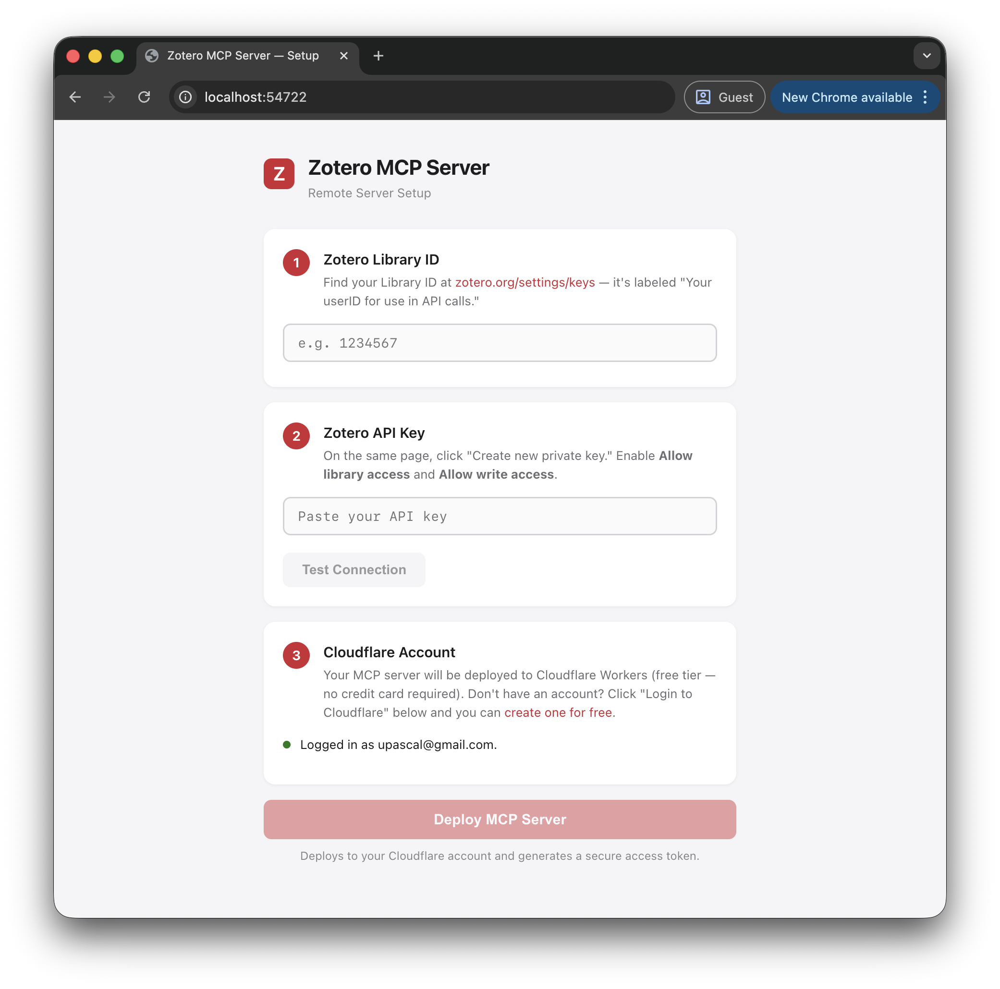
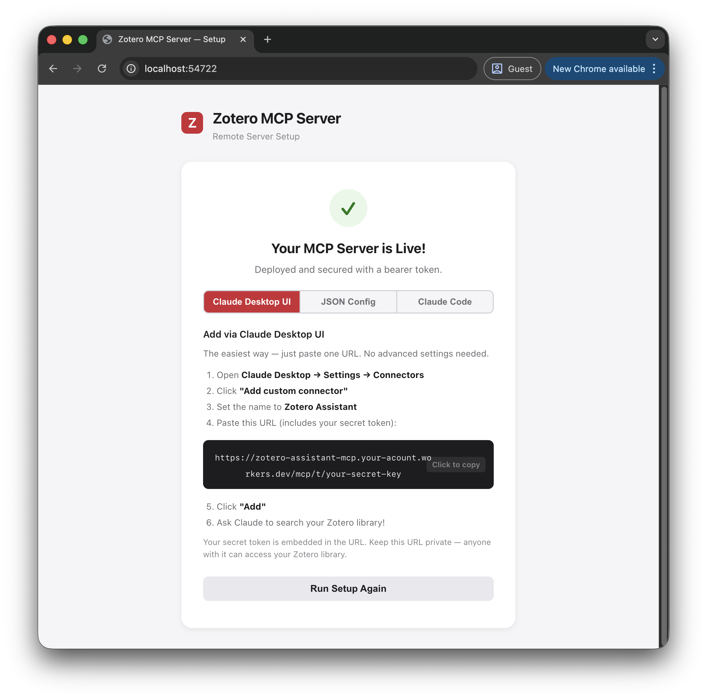
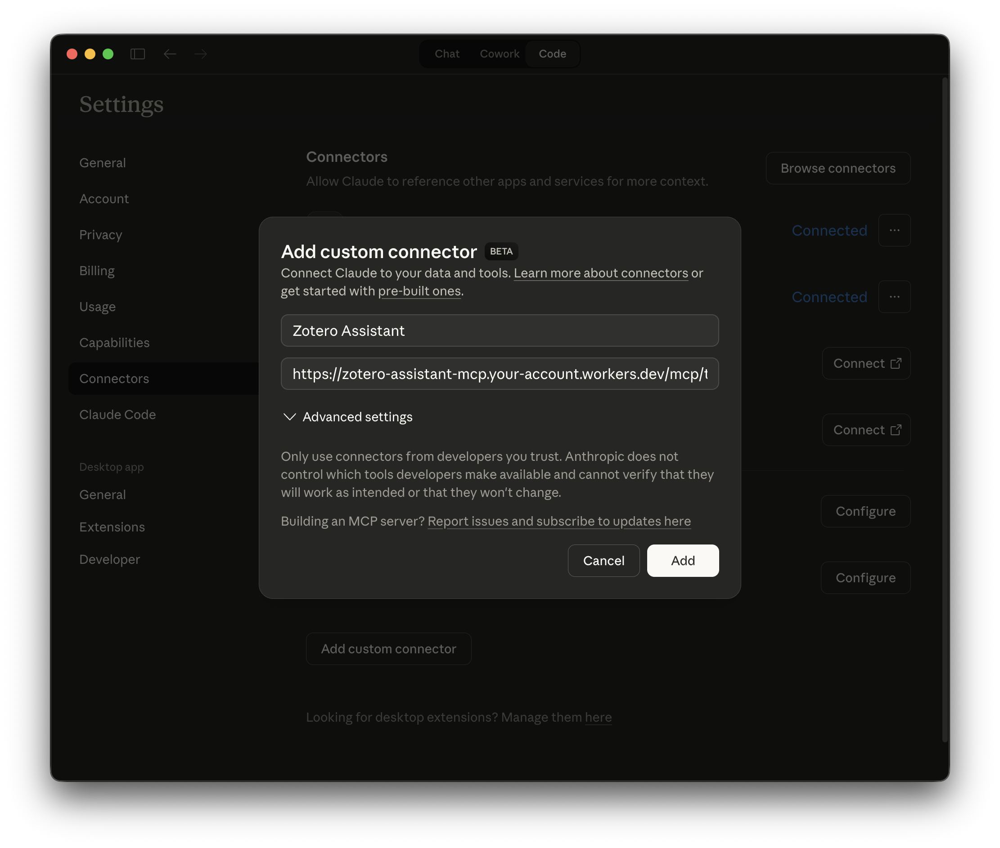
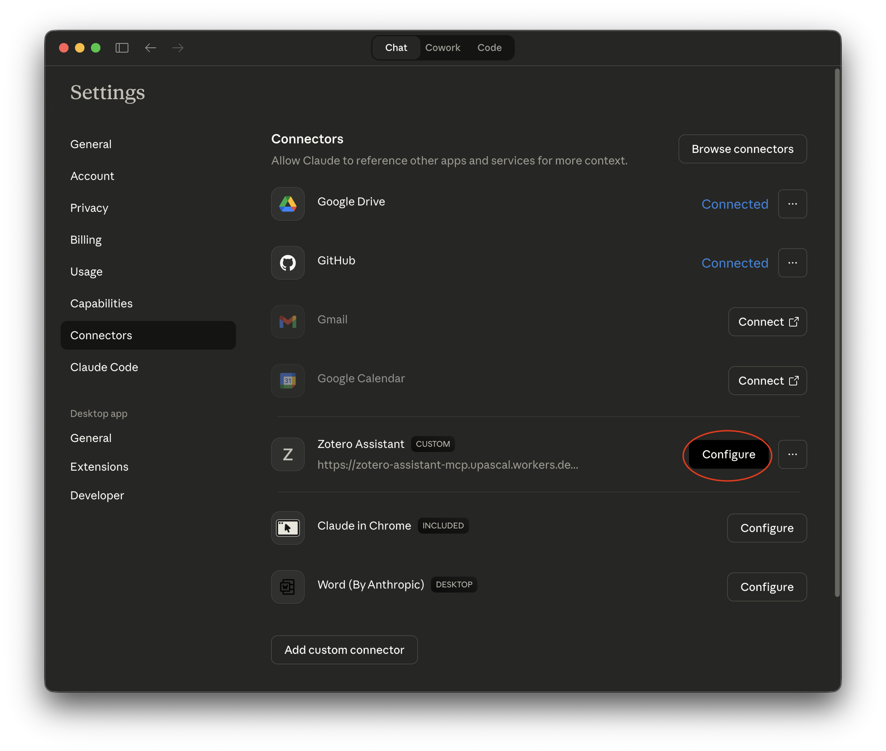
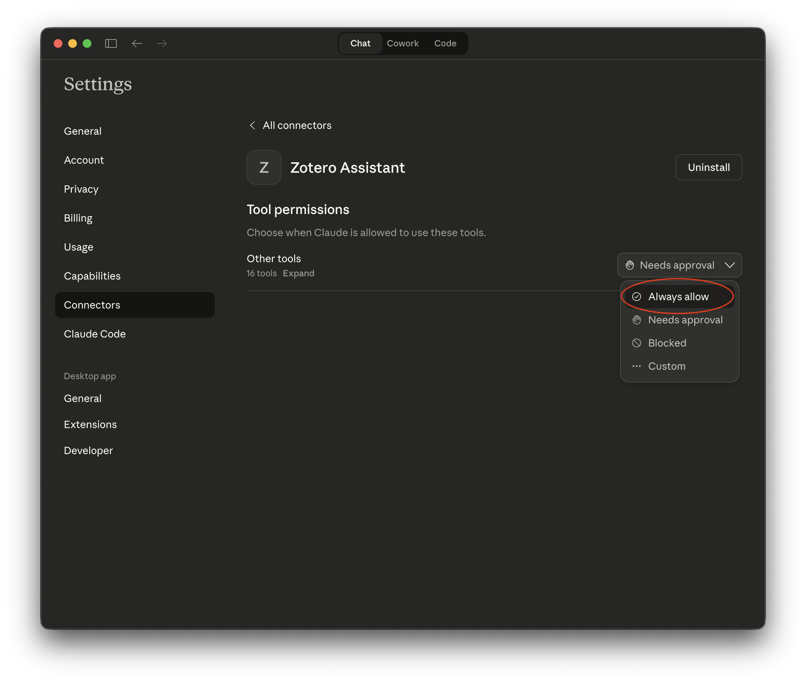

# Zotero Assistant MCP — Remote (Cloudflare Workers)

A remote MCP server for reading, writing, and managing items in your Zotero library, deployed on Cloudflare Workers. Each user deploys their own server to their own Cloudflare account — no shared infrastructure, no cost to anyone but Cloudflare's generous free tier.

## Quick Start (Setup Wizard)

The easiest way to get started — no command line knowledge needed after the first two commands.

### Prerequisites

- [Node.js](https://nodejs.org/) 18+
- A [Zotero account](https://www.zotero.org/) with a library
- A [Cloudflare account](https://dash.cloudflare.com/sign-up) (free tier — no credit card required)

### 1. Clone & install

```sh
git clone https://github.com/upascal/zotero-assistant-mcp-remote.git
cd zotero-assistant-mcp-remote
npm install
```

### 2. Run the setup wizard

```sh
npm run setup
```

This opens a browser-based setup wizard that walks you through:

1. **Zotero credentials** — Enter your Library ID and API key (with a "Test Connection" button to verify)
2. **Cloudflare login** — The wizard detects if you're already logged in. If not, it opens the Cloudflare login page for you.
3. **Deploy** — One click deploys the Worker, sets your secrets, and generates a secure bearer token.

After deployment, the wizard shows your secure MCP URL and gives you three ways to connect:

| Method | Best for |
|--------|----------|
| **Claude Desktop UI** | Paste a single URL into Settings → Connectors → Add custom connector |
| **JSON Config** | Manually edit `claude_desktop_config.json` |
| **Claude Code CLI** | Run a `claude mcp add-json` command in your terminal |

### Screenshots

<p align="center">
  
</p>
<p align="center">
  <text>Enter your Zotero credentials. You can find your Library ID and API key in your Zotero account settings. Click "Deploy" to and follow the instructions add the remote MCP server to Claude Desktop.</text>
</p>

<p align="center">
  
</p>
<p align="center">
  <text>Follow the instructions to connect to Claude Desktop.</text>
</p>
<p align="center">
  
</p>
<p align="center">
  <text>
  Add the remote MCP server to Claude Desktop. You can find your MCP URL in the setup wizard after deployment.
  </text>
</p>

### Optional Settings

<p align="center">
  
  
</p>
<p align="center">
  <text>Turn on "Always allow" for the Zotero Assistant MCP server to avoid having to approve every request.</text>
</p>

## Manual Setup (Advanced)

If you prefer to configure everything yourself without the setup wizard.

### 1. Install dependencies

```sh
npm install
```

### 2. Configure local development credentials

Create a `.dev.vars` file with your Zotero credentials:

```
ZOTERO_API_KEY=your-api-key-here
ZOTERO_LIBRARY_ID=your-library-id-here
BEARER_TOKEN=any-secret-token-for-local-dev
```

### 3. Run locally

```sh
npm run dev
```

The server starts at `http://localhost:8787/mcp`.

### 4. Deploy to Cloudflare

```sh
# Login to Cloudflare (if not already)
npx wrangler login

# Deploy the worker
npm run deploy

# Set production secrets
npx wrangler secret put ZOTERO_API_KEY
npx wrangler secret put ZOTERO_LIBRARY_ID
npx wrangler secret put BEARER_TOKEN
```

### 5. Connect from Claude

**Option A: Claude Desktop UI (recommended)**

Use the token-in-URL format so you can paste a single URL with no advanced settings:

```
https://zotero-assistant-mcp.<your-subdomain>.workers.dev/mcp/t/<your-bearer-token>
```

1. Open Claude Desktop → Settings → Connectors
2. Click "Add custom connector"
3. Set name to **Zotero Assistant**
4. Paste the URL above
5. Click "Add"

**Option B: JSON Config**

Add this to `~/Library/Application Support/Claude/claude_desktop_config.json` (macOS):

```json
{
  "mcpServers": {
    "zotero": {
      "command": "npx",
      "args": [
        "mcp-remote",
        "https://zotero-assistant-mcp.<your-subdomain>.workers.dev/mcp",
        "--header",
        "Authorization:${AUTH_HEADER}"
      ],
      "env": {
        "AUTH_HEADER": "Bearer <your-bearer-token>"
      }
    }
  }
}
```

**Option C: Claude Code CLI**

```sh
claude mcp add-json zotero '{"type":"http","url":"https://zotero-assistant-mcp.<your-subdomain>.workers.dev/mcp","headers":{"Authorization":"Bearer <your-bearer-token>"}}'
```

## Security

Every MCP endpoint is protected by a bearer token. The server supports two authentication methods:

1. **Token in URL path** — `/mcp/t/{token}` (convenient for Claude Desktop's connector UI)
2. **Bearer header** — `Authorization: Bearer {token}` (standard HTTP auth for API/CLI usage)

Unauthenticated requests to `/mcp` return `401 Unauthorized`.

Your Zotero API key and bearer token are stored as [Cloudflare Worker secrets](https://developers.cloudflare.com/workers/configuration/secrets/) — they are encrypted at rest and never exposed in logs or source code.

> **Keep your MCP URL and bearer token private.** Anyone with the token can read and write to your Zotero library.

## Cloudflare Account FAQ

**Do I need a paid Cloudflare plan?**
No. The [Workers Free plan](https://developers.cloudflare.com/workers/platform/pricing/) includes 100,000 requests per day — more than enough for personal MCP usage. No credit card is required to sign up.

**How does the setup wizard detect my Cloudflare account?**
The wizard runs `wrangler whoami` behind the scenes, which checks for a locally stored OAuth token from a previous `wrangler login`. It's the same mechanism the Wrangler CLI uses — no passwords are stored by the setup wizard.

**What if I don't have a Cloudflare account?**
The wizard will show a "Not logged in" status in Step 3. Click "Login to Cloudflare" — this runs `wrangler login`, which opens the Cloudflare website in your browser. From there you can either sign in or create a free account. Once authenticated, the wizard detects your login automatically and you can proceed to deploy.

**Can I sign up with GitHub/Google?**
Yes. Cloudflare supports email, Google, and Apple sign-in. When `wrangler login` opens your browser, you can use any of these methods to create or access your account.

## Available Tools (16)

| Category | Tool | Description |
|----------|------|-------------|
| Utility | `get_help` | Workflow instructions |
| Utility | `get_item_types` | List valid item types |
| Utility | `prepare_url` | Get fetch instructions for a URL |
| Search | `search_items` | Search by text, tags, type, or collection |
| Search | `get_collection_items` | List items in a collection |
| Search | `get_recent_items` | Recently added/modified items |
| Search | `list_collections` | All collections (folders) |
| Search | `create_collection` | Create a new collection |
| Search | `list_tags` | All tags in library |
| Read | `get_item` | Full metadata + children for an item |
| Read | `get_item_fulltext` | Extracted text content |
| Write | `save_item` | Create new item with metadata |
| Write | `attach_pdf` | Attach PDF to existing item |
| Write | `attach_snapshot` | Attach webpage snapshot |
| Write | `create_note` | Create note on existing item |
| Write | `update_item` | Modify metadata/tags |

## Testing with MCP Inspector

```sh
npm run dev  # in one terminal

# in another terminal:
npx @modelcontextprotocol/inspector@latest
```

Open `http://localhost:5173` and connect to `http://localhost:8787/mcp`.

## License

MIT
